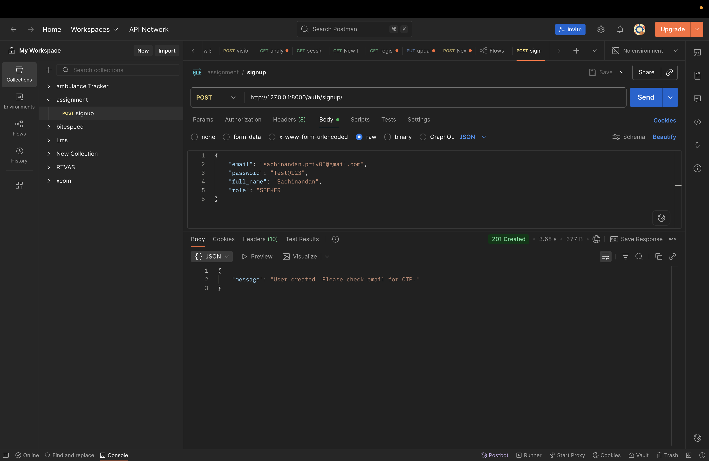
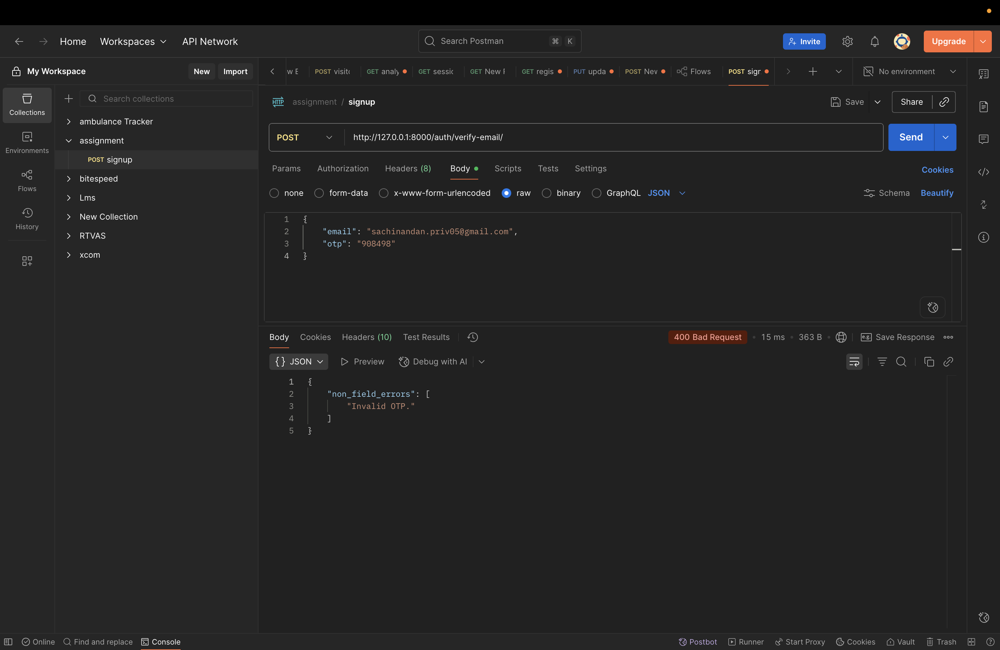
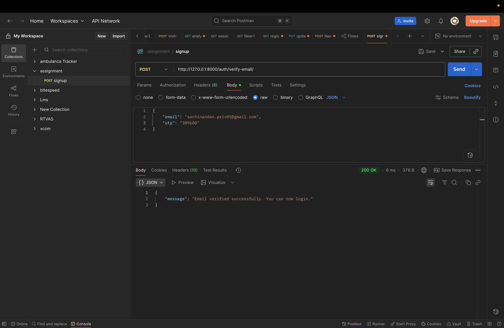

# 📚 Events Platform API Documentation

## Base URL
```
http://127.0.0.1:8000
```

## 🔐 Authentication

All authenticated endpoints require a JWT token in the header:
```
Authorization: Bearer <access_token>
```

---

## 1️⃣ Authentication Endpoints

### 1.1 Register User
Create a new user account with role (SEEKER or FACILITATOR).

| | |
|---|---|
| **URL** | `/auth/signup/` |
| **Method** | `POST` |
| **Auth Required** | No |

**Request Body:**
```json
{
    "email": "user@example.com",
    "password": "Test@123",
    "role": "SEEKER"
}
```

| Field | Type | Required | Description |
|-------|------|----------|-------------|
| email | string | Yes | User's email address |
| password | string | Yes | Password (min 8 chars) |
| role | string | Yes | `SEEKER` or `FACILITATOR` |

**Success Response (201 Created):**
```json
{
    "message": "User created. Please check email for OTP."
}
```

**Error Response (400 Bad Request):**
```json
{
    "email": ["A user with this email already exists."]
}
```

---

### 1.2 Verify Email (OTP)
Verify user's email with the 6-digit OTP sent to their email.

| | |
|---|---|
| **URL** | `/auth/verify-email/` |
| **Method** | `POST` |
| **Auth Required** | No |

**Request Body:**
```json
{
    "email": "user@example.com",
    "otp": "123456"
}
```

**Success Response (200 OK):**
```json
{
    "message": "Email verified successfully. You can now login."
}
```

**Error Responses:**
```json
{
    "non_field_errors": ["Invalid OTP."]
}
```
```json
{
    "non_field_errors": ["OTP has expired."]
}
```

---

### 1.3 Resend OTP
Resend OTP to user's email if expired or not received.

| | |
|---|---|
| **URL** | `/auth/resend-otp/` |
| **Method** | `POST` |
| **Auth Required** | No |

**Request Body:**
```json
{
    "email": "user@example.com"
}
```

**Success Response (200 OK):**
```json
{
    "message": "OTP resent successfully. Please check your email."
}
```

---

### 1.4 Login
Authenticate user and receive JWT tokens.

| | |
|---|---|
| **URL** | `/auth/login/` |
| **Method** | `POST` |
| **Auth Required** | No |

**Request Body:**
```json
{
    "email": "user@example.com",
    "password": "Test@123"
}
```

**Success Response (200 OK):**
```json
{
    "refresh": "eyJhbGciOiJIUzI1NiIsInR5cCI6IkpXVCJ9...",
    "access": "eyJhbGciOiJIUzI1NiIsInR5cCI6IkpXVCJ9...",
    "role": "SEEKER"
}
```

**Error Responses:**
```json
{
    "non_field_errors": ["Invalid credentials."]
}
```
```json
{
    "non_field_errors": ["User is not verified."]
}
```

---

### 1.5 Refresh Token
Get a new access token using the refresh token.

| | |
|---|---|
| **URL** | `/auth/refresh/` |
| **Method** | `POST` |
| **Auth Required** | No |

**Request Body:**
```json
{
    "refresh": "eyJhbGciOiJIUzI1NiIsInR5cCI6IkpXVCJ9..."
}
```

**Success Response (200 OK):**
```json
{
    "access": "eyJhbGciOiJIUzI1NiIsInR5cCI6IkpXVCJ9..."
}
```

---

### 1.6 Password Reset Request
Request a password reset OTP.

| | |
|---|---|
| **URL** | `/auth/password-reset/` |
| **Method** | `POST` |
| **Auth Required** | No |

**Request Body:**
```json
{
    "email": "user@example.com"
}
```

**Success Response (200 OK):**
```json
{
    "message": "If the email exists, a password reset OTP will be sent."
}
```

---

### 1.7 Password Reset Confirm
Reset password using OTP.

| | |
|---|---|
| **URL** | `/auth/password-reset/confirm/` |
| **Method** | `POST` |
| **Auth Required** | No |

**Request Body:**
```json
{
    "email": "user@example.com",
    "otp": "123456",
    "new_password": "NewPass@123",
    "confirm_password": "NewPass@123"
}
```

**Success Response (200 OK):**
```json
{
    "message": "Password reset successful. You can now login with your new password."
}
```

---

## 2️⃣ Events Endpoints

### 2.1 List All Events
Get a paginated list of all events with optional filters.

| | |
|---|---|
| **URL** | `/events/events/` |
| **Method** | `GET` |
| **Auth Required** | Yes |
| **Allowed Roles** | SEEKER, FACILITATOR |

**Query Parameters:**
| Parameter | Type | Description |
|-----------|------|-------------|
| q | string | Search in title/description |
| location | string | Filter by location |
| language | string | Filter by language |
| starts_after | datetime | Events starting after this date |
| starts_before | datetime | Events starting before this date |
| page | integer | Page number |

**Example Request:**
```
GET /events/events/?q=Django&location=Online&language=English
```

**Success Response (200 OK):**
```json
{
    "count": 1,
    "next": null,
    "previous": null,
    "results": [
        {
            "id": 1,
            "title": "Django Workshop",
            "description": "Learn Django from scratch",
            "language": "English",
            "location": "Online",
            "starts_at": "2025-01-15T10:00:00Z",
            "ends_at": "2025-01-15T12:00:00Z",
            "capacity": 50,
            "available_seats": 49,
            "enrolled_count": 1,
            "is_enrolled": false,
            "created_by_email": "facilitator@example.com",
            "created_at": "2025-12-26T10:00:00Z",
            "updated_at": "2025-12-26T10:00:00Z"
        }
    ]
}
```

---

### 2.2 Get Single Event
Get details of a specific event.

| | |
|---|---|
| **URL** | `/events/events/{id}/` |
| **Method** | `GET` |
| **Auth Required** | Yes |
| **Allowed Roles** | SEEKER, FACILITATOR |

**Success Response (200 OK):**
```json
{
    "id": 1,
    "title": "Django Workshop",
    "description": "Learn Django from scratch",
    "language": "English",
    "location": "Online",
    "starts_at": "2025-01-15T10:00:00Z",
    "ends_at": "2025-01-15T12:00:00Z",
    "capacity": 50,
    "available_seats": 49,
    "enrolled_count": 1,
    "is_enrolled": true,
    "created_by_email": "facilitator@example.com",
    "created_at": "2025-12-26T10:00:00Z",
    "updated_at": "2025-12-26T10:00:00Z"
}
```

---

### 2.3 Create Event ⚡ FACILITATOR ONLY
Create a new event.

| | |
|---|---|
| **URL** | `/events/events/` |
| **Method** | `POST` |
| **Auth Required** | Yes |
| **Allowed Roles** | FACILITATOR only |

**Request Body:**
```json
{
    "title": "Django Workshop",
    "description": "Learn Django from scratch with hands-on projects",
    "language": "English",
    "location": "Online - Zoom",
    "starts_at": "2025-01-15T10:00:00Z",
    "ends_at": "2025-01-15T14:00:00Z",
    "capacity": 50
}
```

| Field | Type | Required | Description |
|-------|------|----------|-------------|
| title | string | Yes | Event title |
| description | string | Yes | Event description |
| language | string | Yes | Event language |
| location | string | Yes | Event location |
| starts_at | datetime | Yes | Start time (UTC) |
| ends_at | datetime | Yes | End time (UTC) |
| capacity | integer | No | Max attendees (null = unlimited) |

**Success Response (201 Created):**
```json
{
    "id": 1,
    "title": "Django Workshop",
    "description": "Learn Django from scratch with hands-on projects",
    "language": "English",
    "location": "Online - Zoom",
    "starts_at": "2025-01-15T10:00:00Z",
    "ends_at": "2025-01-15T14:00:00Z",
    "capacity": 50,
    "available_seats": 50,
    "enrolled_count": 0,
    "is_enrolled": false,
    "created_by_email": "facilitator@example.com",
    "created_at": "2025-12-26T10:00:00Z",
    "updated_at": "2025-12-26T10:00:00Z"
}
```

**Error Response (403 Forbidden) - If Seeker tries:**
```json
{
    "detail": "You do not have permission to perform this action."
}
```

---

### 2.4 Update Event ⚡ FACILITATOR ONLY (Owner)
Update an event. Only the creator can update.

| | |
|---|---|
| **URL** | `/events/events/{id}/` |
| **Method** | `PUT` / `PATCH` |
| **Auth Required** | Yes |
| **Allowed Roles** | FACILITATOR (owner only) |

**Request Body (PATCH - partial update):**
```json
{
    "title": "Updated Django Workshop",
    "capacity": 100
}
```

**Success Response (200 OK):**
```json
{
    "id": 1,
    "title": "Updated Django Workshop",
    "description": "Learn Django from scratch with hands-on projects",
    "capacity": 100,
    ...
}
```

---

### 2.5 Delete Event ⚡ FACILITATOR ONLY (Owner)
Delete an event. Only the creator can delete.

| | |
|---|---|
| **URL** | `/events/events/{id}/` |
| **Method** | `DELETE` |
| **Auth Required** | Yes |
| **Allowed Roles** | FACILITATOR (owner only) |

**Success Response (204 No Content)**

---

### 2.6 My Events ⚡ FACILITATOR ONLY
List events created by the logged-in facilitator with enrollment counts.

| | |
|---|---|
| **URL** | `/events/events/my_events/` |
| **Method** | `GET` |
| **Auth Required** | Yes |
| **Allowed Roles** | FACILITATOR only |

**Success Response (200 OK):**
```json
{
    "count": 2,
    "next": null,
    "previous": null,
    "results": [
        {
            "id": 1,
            "title": "Django Workshop",
            "enrolled_count": 5,
            "available_seats": 45,
            ...
        },
        {
            "id": 2,
            "title": "Python Conference",
            "enrolled_count": 150,
            "available_seats": 50,
            ...
        }
    ]
}
```

---

## 3️⃣ Enrollment Endpoints

### 3.1 Enroll in Event ⚡ SEEKER ONLY
Enroll in an event.

| | |
|---|---|
| **URL** | `/events/events/{id}/enroll/` |
| **Method** | `POST` |
| **Auth Required** | Yes |
| **Allowed Roles** | SEEKER only |

**Success Response (201 Created):**
```json
{
    "id": 1,
    "event": 1,
    "event_title": "Django Workshop",
    "event_starts_at": "2025-01-15T10:00:00Z",
    "status": "ENROLLED",
    "created_at": "2025-12-26T15:00:00Z"
}
```

**Error Responses:**
```json
{
    "non_field_errors": ["You are already enrolled in this event."]
}
```
```json
{
    "non_field_errors": ["Event is full."]
}
```
```json
{
    "detail": "You do not have permission to perform this action."
}
```

---

### 3.2 Cancel Enrollment ⚡ SEEKER ONLY
Cancel enrollment from an event.

| | |
|---|---|
| **URL** | `/events/events/{id}/cancel_enrollment/` |
| **Method** | `DELETE` |
| **Auth Required** | Yes |
| **Allowed Roles** | SEEKER only |

**Success Response (200 OK):**
```json
{
    "message": "Enrollment canceled successfully."
}
```

**Error Response:**
```json
{
    "error": "You are not enrolled in this event."
}
```

---

### 3.3 List All My Enrollments ⚡ SEEKER ONLY
List all enrollments for the current user.

| | |
|---|---|
| **URL** | `/events/enrollments/` |
| **Method** | `GET` |
| **Auth Required** | Yes |
| **Allowed Roles** | SEEKER only |

**Success Response (200 OK):**
```json
{
    "count": 2,
    "next": null,
    "previous": null,
    "results": [
        {
            "id": 1,
            "event": 1,
            "event_title": "Django Workshop",
            "event_starts_at": "2025-01-15T10:00:00Z",
            "status": "ENROLLED",
            "created_at": "2025-12-26T15:00:00Z"
        },
        {
            "id": 2,
            "event": 2,
            "event_title": "Python Conference",
            "event_starts_at": "2025-02-20T09:00:00Z",
            "status": "CANCELED",
            "created_at": "2025-12-26T16:00:00Z"
        }
    ]
}
```

---

### 3.4 Upcoming Enrollments ⚡ SEEKER ONLY
List enrollments for events that haven't started yet.

| | |
|---|---|
| **URL** | `/events/enrollments/upcoming/` |
| **Method** | `GET` |
| **Auth Required** | Yes |
| **Allowed Roles** | SEEKER only |

**Success Response (200 OK):**
```json
{
    "count": 1,
    "next": null,
    "previous": null,
    "results": [
        {
            "id": 1,
            "event": 1,
            "event_title": "Django Workshop",
            "event_starts_at": "2025-01-15T10:00:00Z",
            "status": "ENROLLED",
            "created_at": "2025-12-26T15:00:00Z"
        }
    ]
}
```

---

### 3.5 Past Enrollments ⚡ SEEKER ONLY
List enrollments for events that have already ended.

| | |
|---|---|
| **URL** | `/events/enrollments/past/` |
| **Method** | `GET` |
| **Auth Required** | Yes |
| **Allowed Roles** | SEEKER only |

**Success Response (200 OK):**
```json
{
    "count": 1,
    "next": null,
    "previous": null,
    "results": [
        {
            "id": 3,
            "event": 3,
            "event_title": "Old Workshop",
            "event_starts_at": "2025-11-01T10:00:00Z",
            "status": "ENROLLED",
            "created_at": "2025-10-25T10:00:00Z"
        }
    ]
}
```

---

## 4️⃣ API Documentation Endpoints

| URL | Description |
|-----|-------------|
| `/api/docs/` | Swagger UI (Interactive API docs) |
| `/api/redoc/` | ReDoc (Alternative API docs) |
| `/api/schema/` | OpenAPI JSON Schema |

---

## 📊 Role-Based Access Control (RBAC) Summary

| Endpoint | SEEKER | FACILITATOR |
|----------|--------|-------------|
| List Events | ✅ | ✅ |
| View Event | ✅ | ✅ |
| Create Event | ❌ | ✅ |
| Update Event | ❌ | ✅ (owner) |
| Delete Event | ❌ | ✅ (owner) |
| My Events | ❌ | ✅ |
| Enroll | ✅ | ❌ |
| Cancel Enrollment | ✅ | ❌ |
| List Enrollments | ✅ | ❌ |
| Upcoming Enrollments | ✅ | ❌ |
| Past Enrollments | ✅ | ❌ |

---

## 🔴 Error Response Format

All errors follow this format:
```json
{
    "detail": "Error message",
    "code": "error_code"
}
```

Or for validation errors:
```json
{
    "field_name": ["Error message 1", "Error message 2"],
    "non_field_errors": ["General error message"]
}
```

---

## 📝 HTTP Status Codes

| Code | Description |
|------|-------------|
| 200 | OK - Request successful |
| 201 | Created - Resource created |
| 204 | No Content - Resource deleted |
| 400 | Bad Request - Validation error |
| 401 | Unauthorized - Authentication required |
| 403 | Forbidden - Permission denied |
| 404 | Not Found - Resource not found |
| 500 | Internal Server Error |

---

## 🧪 Test Accounts

| Email | Password | Role |
|-------|----------|------|
| sachinandan.priv05@gmail.com | Test@123 | SEEKER |
| test_seeker@test.com | Test@12345 | SEEKER |
| test_facilitator@test.com | Test@12345 | FACILITATOR |

---

## 🚀 Quick Start

1. **Register:** `POST /auth/signup/`
2. **Verify OTP:** `POST /auth/verify-email/`
3. **Login:** `POST /auth/login/`
4. **Use access token** in Authorization header
5. **Refresh token** when expired: `POST /auth/refresh/`

---

## 📸 Screenshots

### Signup API


### Email Verification API


### Login API


